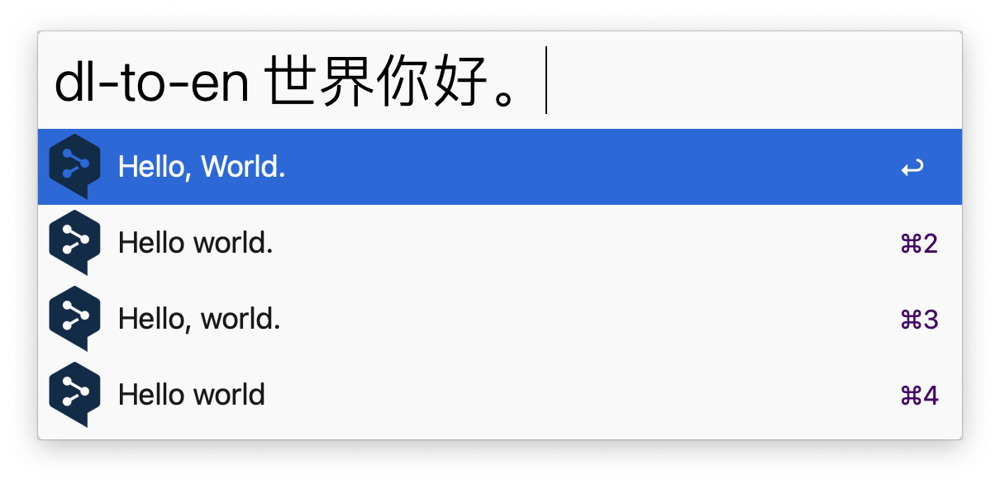
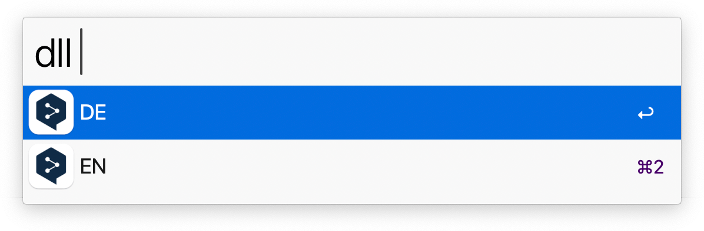
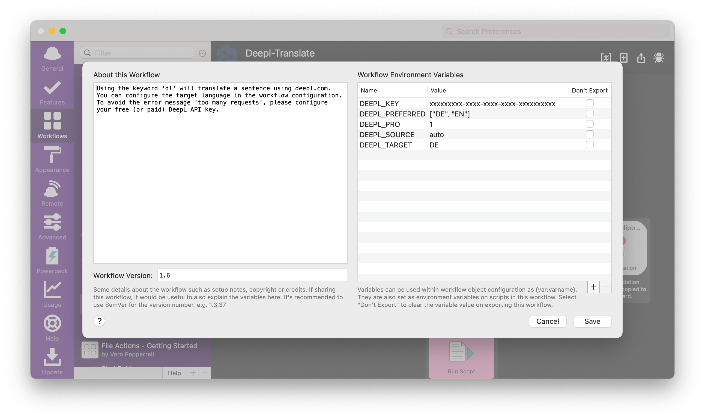

# Alfred DeepL Translation Workflow

[](https://www.codacy.com/gh/AlexanderWillner/deepl-alfred-workflow2/dashboard?utm_source=github.com&amp;utm_medium=referral&amp;utm_content=AlexanderWillner/deepl-alfred-workflow2&amp;utm_campaign=Badge_Grade) [](https://github.com/AlexanderWillner/deepl-alfred-workflow2/releases)

## Usage

To activate this workflow use the default keyword ```dl```, enter the passage you wanna get translated and end the input with ```.``` (not needed if you've an API key). The source language will be inferred automatically and the target language can be configured.


After 1-2 seconds you get the translation. This is just an example.


Press ```↩``` to copy the result or ```⌘ + ↩``` to show result as big screen overlay.
You can also translate any selected text within macOS by pressing ```⌃ + ⌥ + ⌘ + d```.

Other languages are supported as well:



To quickly change the target language, you can use the ```dll``` keyword:



## Caveats

Please note that the DeepL API is designed to translate up to 600 characters per minute and per customer only. This fact and generally some longer sentences might result in the message ```Error: Too many requests.``` (see #5).
However, you can also get a (free or paid) [```API key```](https://www.deepl.com/pro-api) and configure it in the settings (see screenshot below).

## Installing the Workflow

1. Simply download the [last release](https://github.com/AlexanderWillner/deepl-alfred-workflow2/releases)
2. Unzip the file on your computer
3. Install `Deepl-Translate.alfredworkflow` by double-clicking the workflow file and clicking on "Import".

You'll now see the workflow listed in the left sidebar of your Workflows preferences pane.

Once imported, you may want to take a quick look at the workflow settings and setup what keyword you want to use. Further, you can change the target language in the settings as shown in this screenshot:



## Command Line

```shell
$ # DEEPL_TARGET="FR"
$ ./deepl.sh -l DE "This is just an example."
{
  "items": [
    {
      "uid": null,
      "arg": "Dies ist nur ein Beispiel.",
      "valid": "yes",
      "autocomplete": "autocomplete",
      "title": "Dies ist nur ein Beispiel."
    },
    {
      "uid": null,
      "arg": "Das ist nur ein Beispiel.",
      "valid": "yes",
      "autocomplete": "autocomplete",
      "title": "Das ist nur ein Beispiel."
    },
    {
      "uid": null,
      "arg": "Dies ist nur ein Beispiel dafür.",
      "valid": "yes",
      "autocomplete": "autocomplete",
      "title": "Dies ist nur ein Beispiel dafür."
    },
    {
      "uid": null,
      "arg": "Dies ist nur ein exemplarisches Beispiel.",
      "valid": "yes",
      "autocomplete": "autocomplete",
      "title": "Dies ist nur ein exemplarisches Beispiel."
    }
  ]
}
```

## Important configuration variables

* `DEEPL_KEY`: the DeepL API key
* `DEEPL_PRO`: in case you have a professional DeepL account
* `DEEPL_POSTFIX`: the character to the input should end with to mitigate #5
* `DEEPL_TARGET`: the target language of the default `dl` keyword

## Builing the workflow

To create a modified version of the workflow, edit the files and run ```make workflow``` to create an updated workflow.

## Disclaimer

DeepL is a product from DeepL GmbH. More info: [deepl.com/publisher.html](https://www.deepl.com/publisher.html)

This package has been heavily inspired by [m9dfukc's DeepL Alfred Workflow](https://github.com/m9dfukc/deepl-alfred-workflow).
