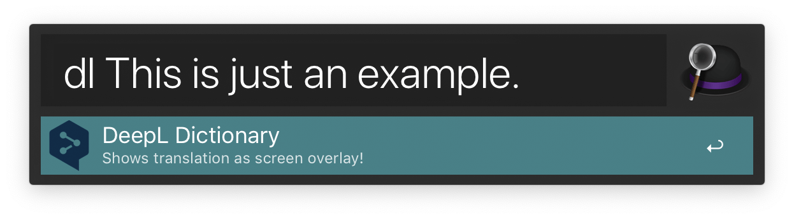
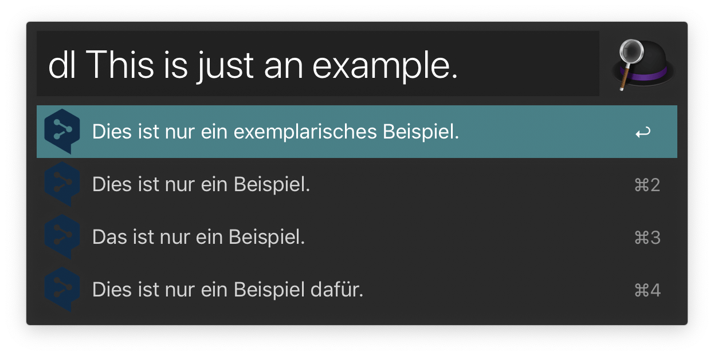

# Alfred DeepL Translation Workflow

[](https://app.codacy.com/app/AlexanderWillner/deepl-alfred-workflow2?utm_source=github.com&utm_medium=referral&utm_content=AlexanderWillner/deepl-alfred-workflow2&utm_campaign=Badge_Grade_Dashboard)

[DeepL.com](https://www.deepl.com/) is a great, new translation service. It provides better translations compared to other popular translation engines. 

## Caveats

This workflow requires the ```jq commandline JSON processor```. Install it e.g. via [brew](https://brew.sh) using ```brew install jq```.

## Installing the Workflow

Simply download the [```DeepL Workflow```](https://github.com/AlexanderWillner/deepl-alfred-workflow2/blob/master/Deepl-Translate.alfredworkflow?raw=true) and install it by double-clicking the workflow file. You can add the workflow to a category, then click "Import" to finish importing. You'll now see the workflow listed in the left sidebar of your Workflows preferences pane.

Once imported, take a quick look at the workflow settings and setup what keyword you want to use.

## Usage

To activate this workflow use the default keyword ```dl```, enter the passage you wanna get translated and end the input with ```.```. Source and destination language will be inferred automatically.



After 1-2 seconds you get the translation. This is just an example.



Press enter to copy the result or ⌘-enter to show result as big screen overlay.

## Command Line

```
$ ./deepl.sh -l DE "This is just an example."
{
  "items": [
    {
      "uid": null,
      "arg": "Dies ist nur ein Beispiel.",
      "valid": "yes",
      "autocomplete": "autocomplete",
      "title": "Dies ist nur ein Beispiel."
    },
    {
      "uid": null,
      "arg": "Das ist nur ein Beispiel.",
      "valid": "yes",
      "autocomplete": "autocomplete",
      "title": "Das ist nur ein Beispiel."
    },
    {
      "uid": null,
      "arg": "Dies ist nur ein Beispiel dafür.",
      "valid": "yes",
      "autocomplete": "autocomplete",
      "title": "Dies ist nur ein Beispiel dafür."
    },
    {
      "uid": null,
      "arg": "Dies ist nur ein exemplarisches Beispiel.",
      "valid": "yes",
      "autocomplete": "autocomplete",
      "title": "Dies ist nur ein exemplarisches Beispiel."
    }
  ]
}
```

## Details

To create a modified version of the workflow, edit the files and run ```make workflow``` to create an updated workflow.

## Disclaimer

DeepL is a product from DeepL GmbH. More info: [deepl.com/publisher.html](https://www.deepl.com/publisher.html)

This package has been heavily inspired by [m9dfukc's DeepL Alfred Workflow](https://github.com/m9dfukc/deepl-alfred-workflow).


